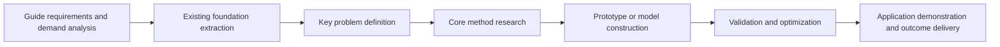

# Government Project Research Plan Writing

## Purpose

This skill guides the agent to draft the main technical sections of a
government research project declaration. It uses knowledge-base materials such
as templates, historical applications, research foundations, team achievements,
and policy guides.

## Knowledge Retrieval Plan

Use the LLM-Wiki index layer first. The index is the map of source folders,
files, and recommended headings.

1. Call `knowledge_search_index` for the selected topic, project type,
   technical domain, and target proposal chapter.
2. Prefer entries whose `applicable_chapters` match the section being written.
3. Call `knowledge_read_file` for the source file paths and headings specified
   in `recommended_sections`.
4. Use the original source sections as references for drafting.
5. If no suitable index exists, state which folder or chapter needs indexing
   before reliable writing, or run `knowledge_incremental_update` when the user
   has placed new files in `_incoming`.

Retrieve through the index:

1. The matched declaration template and chapter requirements.
2. Policy guide requirements and expected outcomes.
3. Existing research foundation related to the selected topic.
4. Historical applications with similar project structures.
5. Team achievements that can support feasibility.
6. Literature-review findings and identified research gaps.

## Standard Output Sections

Generate or revise the following sections:

1. Overall objective.
2. Specific objectives.
3. Main research content, usually 3 to 5 task packages.
4. Technical route.
5. Implementation plan.
6. Key technologies.
7. Innovation points.
8. Expected outcomes.
9. Assessment indicators.
10. Schedule and milestones.
11. Risk analysis and response measures.
12. Objective-task-method-indicator-outcome consistency table.

After generating a reusable research-plan draft, call `proposal_save_markdown`
with section_name `研究方案` or the specific chapter name, so the Markdown is
persisted in the proposal workspace and visible in the front-end Artifacts
panel.

## Research Content Pattern

For each research task, include:

| Field | Description |
| --- | --- |
| Task Name | Concise task title |
| Problem | The issue this task solves |
| Methods | Technical methods or research methods |
| Input Foundation | Relevant existing foundation from the knowledge base |
| Output | Deliverables, data, model, prototype, report, standard, or patent |
| Linkage | How it connects to other tasks |

For the consistency table, map each objective to research tasks, methods,
assessment indicators, expected outcomes, evidence sources, and budget
implications.

## Technical Route Rules

- Express the route as sequential and logical steps.
- Show how prior foundation leads to research tasks and then to outcomes.
- Use Mermaid diagrams when the user needs a route diagram.
- Avoid decorative diagrams; every node should represent real work.

Example route:

## Innovation Point Rules

Innovation points should be:

- Supported by research gaps or existing technical limitations.
- Connected to the applicant's foundation.
- Specific enough to be defensible.
- Separated into theoretical, methodological, technological, application, or
  management innovation when appropriate.

## Quality Checks

Before finalizing, verify:

- Objectives, tasks, route, outcomes, and budget direction are consistent.
- The plan matches the project type and template.
- Innovation points are not generic slogans.
- Assessment indicators are measurable.
- Every major task has a corresponding deliverable.
- Every major factual claim about foundation, achievement, template, or guide
  requirements cites retrieved evidence as `【知识库：title | file_path#anchor】`
  when available.
- Sensitive achievements from historical proposals are not transferred to the
  current applicant unless the user confirms applicability.
